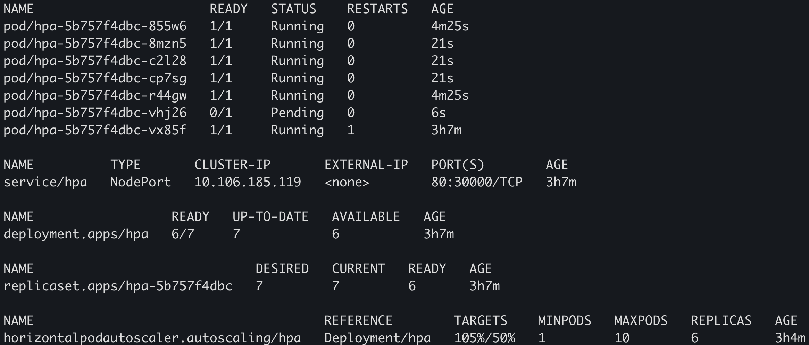

# HPA Kubernetes
> Horizontal Pod Autoscaling for Kubernetes

Generate traffic with bash script for create more pods with the HPA in a virtual cluster hpa-testing (namespace).

## Requirements

Docker: https://www.docker.com/get-started

Kubectl: https://kubernetes.io/docs/tasks/tools/install-kubectl/

Minikube: https://kubernetes.io/es/docs/tasks/tools/install-minikube/


Metrics-Server (For Minikube): 
```sh
minikube addons enable metrics-server
```

## Let's start

Start Minikube: 

```sh
minikube start --vm-driver=virtualbox
```


Create virtual cluster hpa-testing:

```sh
kubectl apply -f 00-namespace.yml
```

Let's see all namespaces:

```sh
kubectl get ns
```


Create NodePort Service:

> Port 30000 -> 80

```sh
kubectl -n hpa-testing apply -f 01-service-node-port.yml
```
Create pods deployment:

```sh
kubectl -n hpa-testing apply -f 02-deployment.yml
```
Let's see pods, services and deployment:

```sh
kubectl -n hpa-testing get all
```


Apply HPA (autoscaling):

```sh
kubectl -n hpa-testing apply -f 03-hpa.yml
```
Let's see pods, services, deployment and hpa:

```sh
kubectl -n hpa-testing get all
```


The HPA cpu initialization period default is 5 minutes.
 
If you wait 5 minutes you can see this...

```sh
kubectl -n hpa-testing get all
```


The numbers of pods are 1 (the minimum) and the CPU load are of 0%.

Now, we need to generate traffic for increment CPU load.

The 04-traffic-generator.sh is a bash script that curl the minikube ip in an infinite loop.

So, in another terminal execute the traffic generator:

```sh
./04-traffic-generator.sh
```
Output:


Now it's increasing the CPU load and if you wait 5 minutes the HPA will have increased the number of pods.

Let's change to the another terminal and see:

```sh
kubectl -n hpa-testing get all
```



You can stop the traffic generator pressing ctrl+c in the another terminal.

